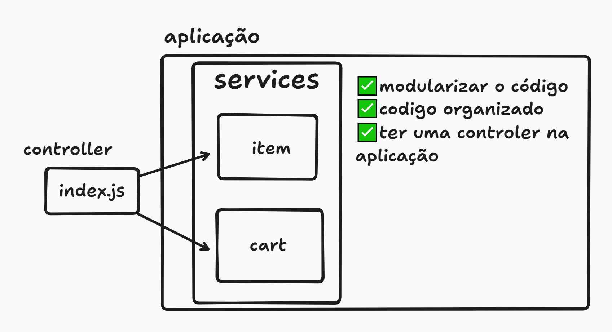

# 🛒 Projeto: Carrinho Shopee (Shopee Cart)

Este projeto simula um carrinho de compras simples em JavaScript, com funcionalidades de adicionar, remover, exibir itens e calcular o total da compra.

<p align="center">
  
</p>

## 📁 Estrutura do Projeto

```
.
├── index.js
└── services
    ├── cart.js
    └── item.js
```

## 🚀 Funcionalidades

### 1. Criar Itens (`item.js`)
Cria objetos de item com nome, preço, quantidade e subtotal automático.

```js
async function createItem(name, price, quantity)
```

#### Exemplo:
```js
const item = await createItem("notebook", 2500.00, 1);
```

---

### 2. Manipular o Carrinho (`cart.js`)

#### ➕ Adicionar item
```js
async function addItem(userCart, item)
```

#### ➖ Remover item por índice
```js
async function removeItem(userCart, index)
```

#### ❌ Deletar item por nome
```js
async function deleteItem(userCart, name)
```

#### 💰 Calcular total
```js
async function calculateTotal(userCart)
```

#### 🧾 Exibir carrinho
```js
async function displayCart(userCart)
```

---

### 3. Lógica Principal (`index.js`)

No arquivo principal:

- Cria dois arrays: `myCart` e `myWishList`;
- Cria dois itens: `notebook` e `pc novinho`;
- Adiciona os dois itens ao carrinho;
- Calcula e exibe o total;
- Remove um item;
- Exibe o novo carrinho e recalcula o total.

---

## 📦 Como Executar

1. Certifique-se de ter o Node.js instalado.
2. Salve os arquivos acima conforme a estrutura.
3. Execute o projeto com o comando:

```bash
node index.js
```

---

## ⚠️ Consideração

- O projeto é assíncrono, mas por enquanto não há operações de I/O que exigiriam `async`. Pode-se otimizar retirando os `async` se desejar.

---

## 📚 Conceitos Aplicados

- Programação assíncrona  
- Modularização com `import`/`export`  
- Arrays e funções de array (`push`, `splice`, `reduce`, `forEach`)  
- Organização de código com responsabilidade separada
